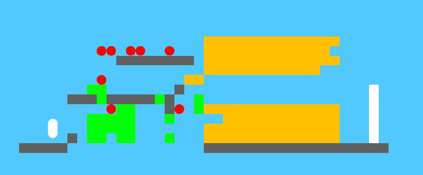

# VAErio-Bros

## Summary
[VAErio Bros System Architecture](documentation/system_architecture.png)

## Project Video

[github copy](https://github.com/gameaischool2021members/vaerio-bros/blob/main/documentation/vaerio-bros-video.mkv)

## Project Members
- [Daniel Harborne](https://www.linkedin.com/in/daniel-harborne/)
- James Adey
- [Luis Andres Equiarte-Morett](https://www.linkedin.com/in/luis-andr%C3%A9s-eguiarte-morett-695965121/)
- [Tobias Huber](https://www.uni-augsburg.de/en/fakultaet/fai/informatik/prof/hcm/team/tobias-huber/)
- [Dr. Sebastian Deterding](https://www.linkedin.com/in/sebastiandeterding)
- [Arash Moradi](https://twitter.com/arashdeclares)
- [Rishabh Chakrabarty](https://notrishabh.co)
- [Miguel Gonzalez-Duque](https://www.miguelgondu.com/about/)

## A Level (using WIP Mario engine)

