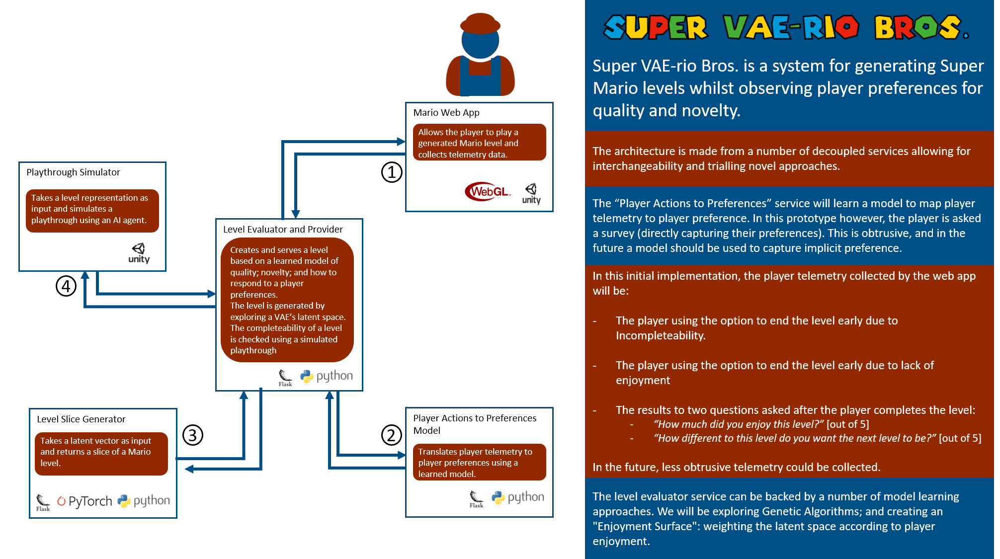

# VAErio-Bros

## Summary

## Project Video
https://www.youtube.com/watch?v=0jhuVwBHYJM

[github copy](https://github.com/gameaischool2021members/vaerio-bros/blob/main/documentation/vaerio-bros-video.mkv)

## Project Members
- [Daniel Harborne](https://www.linkedin.com/in/daniel-harborne/)
- James Adey
- Luis Andres Equiarte-Morett
- [Tobias Huber](https://www.uni-augsburg.de/de/fakultaet/fai/informatik/prof/hcm/team/tobias-huber/)
- Dr. Sebastian Deterding
- Arash Moradi
- Rishabh Chakrabarty
- Miguel Gonzalez-Duque

## Presentation Video: 

## A Level (using WIP Mario engine)

