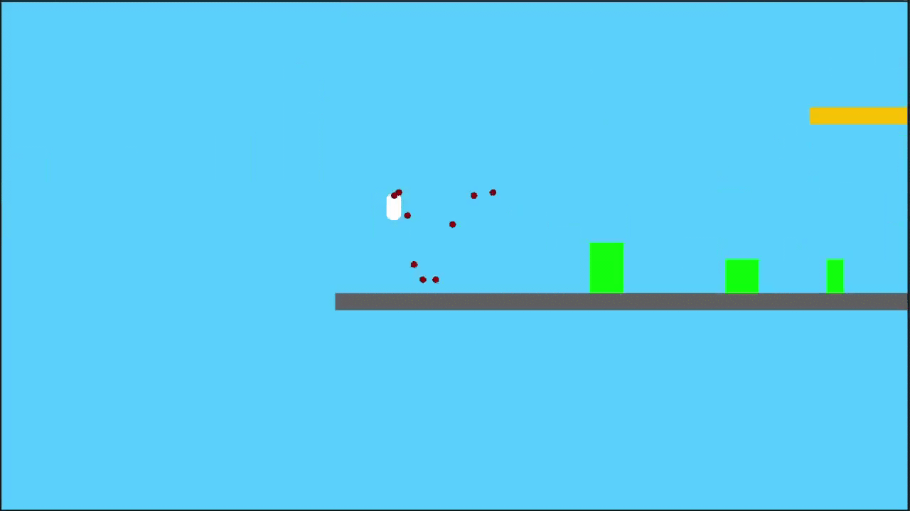

## Overview

This folder contains our simplified implementation of the Mario A* solver by Robin Baumgarten (https://github.com/jumoel/mario-astar-robinbaumgarten)

*AStarSimulator* contains the main planning functions.

*levelScene* can save snapshots of the current level to use for the search nodes during planning.

*StepGameManager* runs the planning by stepping through the game's physics simulation without using the normal update loop.

## The A* algorithm solving a level

